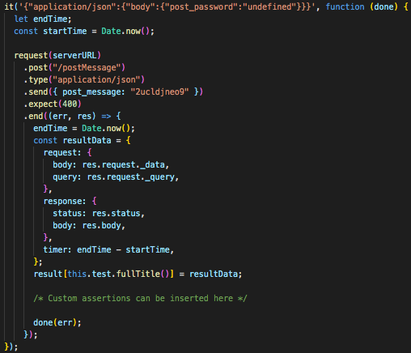
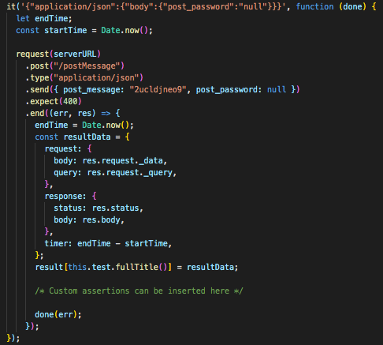
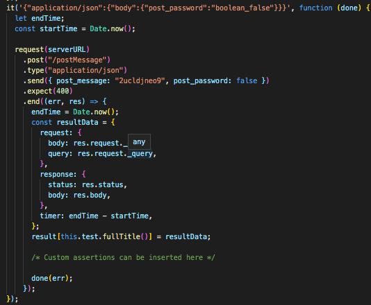
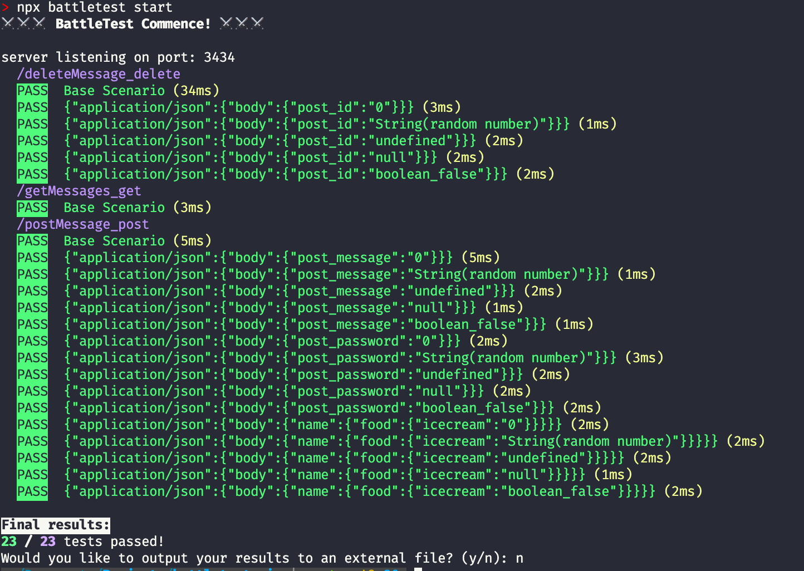

<div align="center"></img></div>

<p style="text-align: center;">
[](https://travis-ci.com/oslabs-beta/battletest)
[](https://npmcharts.com/compare/battletest?minimal=true)
[](https://packagephobia.now.sh/result?p=battletest)
</p>

Command-line tool for auto-generating Node.js endpoint test suites with random data for comprehensive endpoint testing.  Faster test writing, happier developers :sunglasses:

## Why Use Battletest?

Modern web APIs must be built to handle requests with any data type, including invalid ones.  __*For instance, if a client sends a request with an extremely long string or -1 in the "ticker" field that should only contain a short string, will the server process fail?*__ 

Battletest.js will take in the shape of the intended request object, and generate many test requests that vary each field of the request object by a single unexpected value.  By testing the backend as such, the developer can easily determine if there are any random test requests that might make the web API backend fail. 

#### Built for Express.js & OpenAPI v3.03

Battletest will read a configuration file ( `battletest.config.js` ) containing the shape of the expected HTTP request for each endpoint/method, and output for each endpoint/method a testing suite that leverages [Mocha](https://github.com/mochajs/mocha), [Chai](https://github.com/chaijs/chai) & [Supertest](https://github.com/visionmedia/supertest) to test how the server handles requests containing unexpected data types.

Battletest can also parse a [express-js](https://github.com/expressjs/express) server file or a [OpenAPI v3.03](https://github.com/OAI/OpenAPI-Specification/blob/master/versions/3.0.3.md) document to prepopulate most (express-js server file) or all (OpenAPI document) of `battletest.config.js` .

## Content

* [Installation](#Installation)
* [Getting Started](#getting-started)
  + [Initialize `battletest.config.js` ](#initialize-battletest.config.js)
    - [Specifying Data Types](#Specifying-Data-Types)
    - [Sample `battletest.config.js` ](#Sample- `battletest.config.js` )
    - [Using an OpenAPI Document](#Using-an-OpenAPI-Document)
    - [Using an Express-js server file](#Using-Express-js-server-file)
  + [Generating test files](#generate-test-files)
  + [Running tests](#run-test-suites)
  + [Viewing test results](#view-test-results)
* [How the Test Data is Generated](#how-the-test-data-is-generated)
* [Contributing](#contributing)
* [Credits](#credits)

# Installation

``` 
$ npm install -g battletest

$ npm install --save-dev battletest
```

Install with the `--save-dev` flag in place of the `-g` flag for a local project-specific  installation.

# Getting Started

## Initialize `battletest.config.js` 

``` 
$ battletest init

$ battletest init <server.js>
$ battletest init <petstore.yaml>
$ battletest init <petstore.json>
```

This creates a new `battletest.config.js` in your project's root directory.  

Battletest can optionally parse either an Express-js server.js file or OpenAPI specification to create a prepopulated `battletest.config.js` . If a file path is not specified, a skeleton configuration file will be created.

`battletest.config.js` generally follows [OpenAPI v3.03](https://github.com/OAI/OpenAPI-Specification/blob/master/versions/3.0.3.md) to define endpoints, methods and expected data type.

* __serverLocation__: Path to the server.js file from the project's root directory.  This path will be used for setup & teardown of the server during the test execution, as provided in `testSetup.js` .  

* __expectedStatusCode__: This is the status code the server should return if the server has correctly processed the client's malformed request, i.e. 400.  

* __paths__: This is an object that contains each Path available on the server as the key. 
    - __Operation__: Each Path has one or more operation (or method) available to it, e.g., "get", "put", "post", etc.  It contains a __Parameters__ object and a __RequestBody__ object.

    - __Parameters__: Array of objects, each specifying a parameter and a location.  Possible locations are "path", "query", "get" and "cookie".

        

``` js
        parameters: [{
                name: "petID", // <-- field key
                in: "path", // <-- field location
                schema: {
                    type: "integer"
                },
            },
            {
                name: "lastVisitedDate",
                in: "cookie", // <-- field location
                schema: {
                    type: "string"
                },
            }
        ]
```

    - __RequestBody__: Object describing the body of a single request. It may have multiple Content-Types as keys.  Content type `application/json` 

        

``` js
        requestBody: {
            "application/json": {
                schema: {
                    type: "object",
                    properties: {
                        name: {
                            type: "string"
                        },
                        petType: {
                            type: "string"
                        },
                        favoriteFoods: {
                            type: "array",
                            items: {
                                type: "string"
                            }
                        }
                    }
                }
            },
            "text/html": {
                schema: {
                    type: "string"
                }
            }
        }
```

[↥Back to top](#battletestjs)

## Specifying Data Types

Possible data types include "array", "object", "integer", "number" and "string".

* __String__, __Integer__, __Number__: These types can be specified as below.

    

``` js
    username: {
        type: "string"
    }
    userid: {
        type: "integer"
    }
    zipcode: {
        type: "number"
    }
```

* __Object__: Object type needs to have the sibling key __properties__ that specify the object's keys and the expected data type for each.  Nested objects and arrays are permitted.

    

``` js
    // Specifying that request field "family" is an object, containing keys "mom"
    family: {
        type: "object",
        properties: {
            mom: {
                type: "string"
            },
            dad: {
                type: "string"
            },
            siblings: {
                type: "object",
                properties: {
                    sisters: {
                        type: "array",
                        items: {
                            type: "string"
                        }
                    },
                    brothers: {
                        type: "array",
                        items: {
                            type: "string"
                        }
                    },
                },
            },
        },
    },
```

* __Array__: Array type needs to specify the data type of __items__ as well.  Array of nested objects is permitted.

    

``` js
    // Specifying that request field "favoriteFoods" expects property 
    favoriteFoods: {
        type: "array",
        items: {
            type: "string"
        }
    }
```

[↥Back to top](#battletestjs)

## Sample `battletest.config.js` 

``` js
module.exports = {
    serverLocation: "server.js",
    serverURL: "http://localhost:8000",
    authorization_cookie: null,
    expectedStatusCode: 400,
    paths: {
        "/pet/:petID": {
            GET: { // <-- Operation 
                parameters: [{
                        name: "petID",
                        in: "path",
                        schema: {
                            type: "integer",
                        },
                    },
                    {
                        name: "lastVisitedDate",
                        in: "cookie",
                        schema: {
                            type: "string"
                        },
                    }
                ],
            },
        }
    }
}
```

For more sample `battletest.config.js` files, please see [here](documentation/examples).

[↥Back to top](#battletestjs)

### Using Express-js server file 

Express-js server file must export "app" and "server" separately in order for Battletest's parsing logic to introspect the server code.

``` js
module.exports = {
    app,
    server
};
```

Resulting `battletest.config.js` will show the full shape of the request, with expected data types noted as "null". __User needs to specify the expected data type for each request field__, along with __serverLocation__ and __serverURL__. Please see sample output [here](documentation/examples/expressParser-battletest.config.js).

```js  
// sample Path object from battletest.config.js outputed from expressParser

module.exports = {
  serverLocation: null, // <-- user to specify
  serverURL: null, // <-- user to specify
  authorization_cookie: null, // <-- user to specify
  expectedStatusCode: 400, 
  paths: {

    "/postMessage": {
      post: {
        requestBody: {
          "application/json": {
            schema: {
              type: "object",
              properties: {
                post_message: {
                  type: null // <-- user to specify
                },
                post_password: {
                  type: null // <-- user to specify
                }
              }
            }
          }
        }
      }
    },

}

``` 
[↥Back to top](#battletestjs)

### Using an OpenAPI Document 

Battletest uses SwaggerParser to validate & parse OpenAPI v3.03 documents. As OpenAPI documents specify the expected data type for each request field, resulting `battletest.config.js` will have been completedly populated other than __serverLocation__ and __serverURL__ for the dev server. Please see sample output [here](documentation/examples/openAPIparser-battletest.config.js). Battletest does not currently support OpenAPI v2.0 documents.

```js
// sample battletest.config.js output from an OpenAPI v.3.03 Document

module.exports = {
  serverLocation: null, // <-- user to specify
  serverURL: null, // <-- user to specify
  authorization_cookie: null, // <-- user to specify
  expectedStatusCode: 400,
  paths: {
    "/pets": {
      get: {
        parameters: [
          {
            name: "tags",
            in: "query",
            description: "tags to filter by",
            required: false,
            style: "form",
            schema: {
              type: "array",
              items: {
                type: "string"
              }
            }
          },
          {
            name: "limit",
            in: "query",
            description: "maximum number of results to return",
            required: false,
            schema: {
              type: "integer",
              format: "int32"
            }
          }
        ]
      },
    }
  }
```

[↥Back to top](#battletestjs)

## Generate Test Files

``` 
$ battletest generate

$ battletest generate <endpoint-name>
```

This will parse the newly created `battletest.config.js` and generate test files under `__battletest__` in your project's directory.  To only generate tests for a particular endpoint, pass in the endpoint name as an argument. 

Sample test cases are as below:

* Request where body.post_password is "undefined".

  

* Request where body.post_password is "null".

  

* Request where body.post_password is "false".

  

For sample test files, please see [here](documentation/examples).

## Running Tests

``` 
$ battletest start

$ battletest start <test-file-name>
```

Please ensure that your server file exports the server using `module.exports = { server }` .  This ensures that ` testSetup.js` can launch and close the server.



This will instruct [Mocha](https://github.com/mochajs/mocha) to run all tests contained in `__battletest__` folder.  To run a specific test file only, pass the test file path as an argument.

A __.json file__ containing the result of each testing suite will be saved to `__battletest__/__result__` once a test file has run.  Each .json file will contain information on:

* Full details of the request that was sent to the test server
* Full details of the response that was received from the server
* Whether the test passed or failed -- boolean
* Time taken for the request-response cycle to complete

## View Test Results

To Be Updated

# How the Test Data is Generated

For each endpoint/operation, battletest will generate (i) base scenario that contains data that conform to proper data types, and (ii) other test scenarios that replace a single field in a base scenario with invalid data type or random data.

For instance, invalid data to be tested for a __number__ field includes, among others: 

* null
* 0
* undefined
* false
* empty string
* empty object
* empty array
* positive infinity
* negative infinity
* random string

For details on how the random test data is generated, please see the relevant code [here](lib/generate/genRandom).

[↥Back to top](#battletestjs)

# Contributing

Pull requests are welcome. For major changes, please open an issue first to discuss what you would like to change. For an overview diagram for the codebase, please see [here](documentation/images/battletest-uml.png).  For full API documentation, please see [here](documentation/index.html)

[↥Back to top](#battletestjs)

# Credits

Binta Kinteh [@BintaKinteh](https://github.com/BintaKinteh) | Duygu Yigitsoy [@dyigitsoy](https://github.com/dyigitsoy) | Kevin Luo [@LuoKevin](https://github.com/LuoKevin) | Soobin Kim [@soobinkim1](https://github.com/soobinkim1) | Yula Ko [@yulako](https://github.com/yulako)

[↥Back to top](#battletestjs)
